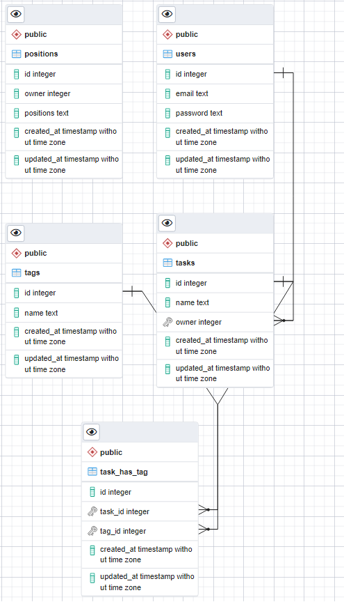

# ToDO lis application
### This is the project I did during my O'Clock training (Full Stack JS). This is simple to-do list. Users can register, login, create/delete/update the tasks and assign the tags to the tasks. The tags can be removed by double-clicking the tag.

### I use SortableJS for drag-and-drop. The positions of the tasks are stored in database.

## DB Scheme
